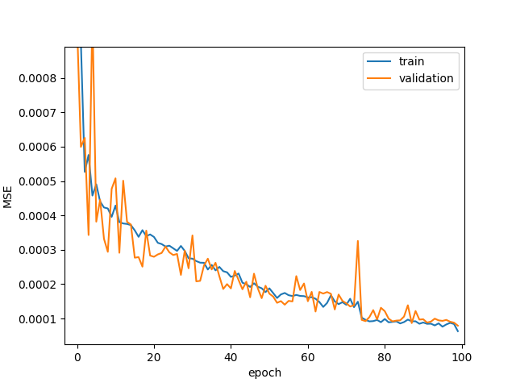

# LODsmartAR
Our goal in this project is to optimize the quality of experience in a AR/MR environment. The user experience is affected mainly by the quality of the rendered model perceived by the user and the update frequency of the 3D model as the user moves.

In order to optimize the QoE we need to trade off quality with update frequency. In order to achieve this, we use different Level of Details and we choose the best LOD that optimizes the user experience.

## SSIM predictor
The first step in our project is to evaluate the quality of the rendered model with metrics that best represent the quality as perceived by the user. In this first experiment I used the SSIM metric to represent the quality of a rendered 3D model from a specific camera position and orientation. The SSIM of a specific LOD is calculated by comparing it with the best version of the 3D model.\
In this first test I developed a deep learning model which takes in input the 3D coordinate of the camera position (we may include the camera orientation in the future, for now we assume it's looking at (0,0,0)) and the NN outputs the predicted SSIM for each LOD. Therefore the NN has 3 inputs and one output for each LOD.

### Dataset
In `random_walk_uniform.py` I generated 100 random camera positions around the center of the 3d model in a uniformly manner. This way we have a uniform sampling of the "complexity" of the 3d model viewed from any direction. These positions are then fed to Unity which takes a screenshot in every generated camera position in every LOD.
For example in the "LacockAbbey" 3d model we have 4 version of the mesh, we use the best version as reference and given a specific camera position we compare the reference LOD with the other LODs of the mesh resulting in 3 SSIMs.
As we can see in the plot below, the SSIMs tend to be higher as the camera is positioned farther from the center.


The correlation is more visible in the following plot which shows the distance of the camera from the center with respect to its ssim. We can also see that lower LOD have higher SSIMs as excpected (in our numeration LOD 0 is the closest to the Camera, and therefore the most detailed LOD level)


### NN architecture
In this test I used the following neural network architecture with the input layer consting of 3 nodes, 2 hidden layers consisting of 128 nodes each and an output layer with one node for each lod level.
```
    nn.Linear(3, 128),
    nn.ReLU(),
    nn.Dropout(dropout),
    nn.Linear(128, 128),
    nn.ReLU(),
    nn.Dropout(dropout),
    nn.Linear(128, len(LOD_NAMES)),
    nn.ReLU()
```

I split the dataset into 80 samples for training set and 20 samples for validation set, k-fold cross validation could be used in the future. For the loss function I chose the mean squared error which is I think is the most reasonable since we are working in eucledean space.\
In order to reduce overfitting I applied some regularization techniques such as dropout, l2 weight decay and reduce learning rate on plateau scheduler. 

### Results
After training for 200 epochs these are the results. The training took a very short time (in the order of few seconds). As we can see both training and validation loss appear to be very low which indicates a good fit of the model (not overfitting nor underfitting).


In the following plot we try to infer the model by changing the x and z coordinate and keeping the y coordinate to one and we chose an arbitrary lod to plot the ssim at different positions. As we can see the model correctly learned that we have lower SSIMs (corresponding to lower quality) the closer the camera is positioned to the mesh.


Here I report the prediction of a batch of validation samples outputted by the model:
```
example prediction: tensor([[1.0038, 0.9592, 0.8812],
        [0.9182, 0.8352, 0.7114],
        [0.9479, 0.8664, 0.7588],
        [0.9455, 0.8838, 0.7823]])
example label: tensor([[0.9573, 0.9149, 0.8520],
        [0.9260, 0.8424, 0.7204],
        [0.9430, 0.8681, 0.7632],
        [0.9509, 0.8849, 0.7774]])
```

## Positions predictor
During the rendering of the 3d model in a MR environment, the user is able to freely move around the 3d objects. In order to achieve our goal of optimizing the user experience we have to choose the optimal LOD to render which would give the perfect balance between visual quality and rendering speed. \
Let's assume that the user is positioned somewhere in space and is moving around, we have to optimize the visualization by picking the best LOD to render in the following frames. Therefore, we have to predict the movements of the user in order to know if the user is moving into a position from which the mesh is more or less complex.\
We have seen that by using the camera position we can accurately estimate the perceived quality of the rendered 3D model for each LOD. Therefore, if we can predict the next positions of the user we will be able to pick the best LOD to render in the successive frames.

### Dataset
In this first test I generated a simulated random walk consisting of 10k positions samples (see `random_walk.py`). The following image shows the plot of the random walk.


###  NN architecture
Predicting the next camera positions is a time series analysis problem. The approach I took is by using a LSTM, taking in input a sequence of 20 latest camera positions and outputting the next camera position (we may want to predict multiple successive positions in future work).\
In this test I used 128 hidden features and two LSTM layers in series. ~~Regularizations are also applied here with dropout and l2 weight decay.~~ After a quick test with and without regularization, I found that without using dropout and weight decay is performing a bit better.
```
LSTM(
  (lstm): LSTM(3, 128, num_layers=2, batch_first=True)
  (linear): Linear(in_features=128, out_features=3, bias=True)
)
```

### Results
After training with Adam optimizer with learning rate starting from 1e-3 and MSE loss function, here is the training curve after 100 epochs.


At epoch 100 the training and validation loss are the following:
```
Train avg loss: 0.007497
Eval avg loss: 0.014971
```

Here I report the prediction of a batch of validation samples outputted by the model:
```
example prediction: tensor([[-5.2743e-03,  8.1226e-05,  5.0937e-01],
        [ 5.6479e-01,  7.1842e-05,  6.9548e-01],
        [ 6.0663e-01,  8.3087e-05,  6.9826e-01],
        [ 4.9452e-01, -1.5524e-04, -1.1854e-01]])
example label: tensor([[-0.0081,  0.0000,  0.5205],
        [ 0.5629,  0.0000,  0.7017],
        [ 0.6045,  0.0000,  0.7029],
        [ 0.5000,  0.0000, -0.1397]])
```

### Update 27/4/2021
For comparison, I implemented a naïve model which simply returns the last position of the input sequence, without predicting anything.
```
naive model train loss: 0.00713
naive model val loss: 0.0141
```
As we can see, both training and validation loss of our model is very close to the losses of the naïve model. This implies that our model isn't really predicting much. This could indicate an issue with our deep learning model, or that the random generated path is too random. Either way, further investigation is needed.

## Dynamic SSIM predictor
The quality of experience in a AR/MR environment is also affected by the lag of the animation. The lag depends on two main factors: the refresh rate of the rendering and the speed of the camera as the user moves around the rendered mesh. We measure the lag as the difference in visual appearance between successive frames using the SSIM index. \
When the user moves around the 3D object, the faster the user is moving and the slower the refresh rate is, the farther apart are the camera positions between successive frames, therefore the lower the SSIM is. \
We call this index the "dynamic SSIM" which is in contrast to the first experiment where the SSIM is measured from a static camera position.

### NN architecture
In this test I used a feed-forward neural network which takes in input the two positions from which the 3d object is rendered from, and outputs the SSIM between the two frames.
```
NeuralNetwork(
  (linear_relu_stack): Sequential(
    (0): Linear(in_features=6, out_features=128, bias=True)
    (1): ReLU()
    (2): Dropout(p=0, inplace=False)
    (3): Linear(in_features=128, out_features=128, bias=True)
    (4): ReLU()
    (5): Dropout(p=0, inplace=False)
    (6): Linear(in_features=128, out_features=1, bias=True)
    (7): ReLU()
  )
)
```




```
example input: tensor([[ 2.6785,  2.7059, -3.7737,  2.3978,  2.8071, -3.5982],
        [ 0.6696,  1.6818,  1.6361,  0.7287,  1.8295,  1.2207],
        [ 2.4919,  1.9658, -4.4340,  2.4167,  1.9548, -4.3911]])
example prediction: tensor([0.4856, 0.3584, 0.5739])
example label: tensor([0.4657, 0.3591, 0.6057])
```

## Dynamic SSIM predictor with generic 3d model
```
MultimodelNN(
  (cnn): ConvNN(
    (cnn): Sequential(
      (0): Conv2d(3, 32, kernel_size=(3, 3), stride=(1, 1), padding=(1, 1))
      (1): ReLU()
      (2): MaxPool2d(kernel_size=4, stride=4, padding=0, dilation=1, ceil_mode=False)
      (3): Conv2d(32, 64, kernel_size=(3, 3), stride=(1, 1), padding=(1, 1))
      (4): ReLU()
      (5): MaxPool2d(kernel_size=4, stride=4, padding=0, dilation=1, ceil_mode=False)
      (6): Conv2d(64, 64, kernel_size=(3, 3), stride=(1, 1), padding=(1, 1))
      (7): ReLU()
      (8): MaxPool2d(kernel_size=4, stride=4, padding=0, dilation=1, ceil_mode=False)
      (9): Conv2d(64, 64, kernel_size=(3, 3), stride=(1, 1), padding=(1, 1))
      (10): ReLU()
      (11): MaxPool2d(kernel_size=4, stride=4, padding=0, dilation=1, ceil_mode=False)
      (12): Flatten(start_dim=1, end_dim=-1)
    )
  )
  (ffn): FeedForwardNN(
    (linear_relu_stack): Sequential(
      (0): Linear(in_features=71, out_features=256, bias=True)
      (1): ReLU()
      (2): Dropout(p=0, inplace=False)
      (3): Linear(in_features=256, out_features=256, bias=True)
      (4): ReLU()
      (5): Dropout(p=0, inplace=False)
      (6): Linear(in_features=256, out_features=1, bias=True)
    )
  )
)
```

```
Epoch 100
-------------------------------
Train avg loss: 0.000085
Eval avg loss: 0.000121 

________ TEST ________
Eval avg loss: 0.000262 

example input: tensor([[-0.0771,  0.6844, -1.0719, -0.0585,  0.7416, -0.9252,  1.0000],
        [-0.2553,  0.4251,  0.7548, -0.2645,  0.5353,  0.6698,  2.0000],
        [-0.2674,  0.7139,  0.0921, -0.2674,  0.7139,  0.0921,  2.0000],
        [ 0.9022,  0.3333, -0.2704,  0.8856,  0.3658, -0.2393,  2.0000]],
       device='cuda:0')
example prediction: tensor([[0.9588],
        [0.8915],
        [0.9619],
        [0.9564]], device='cuda:0')
example label: tensor([[0.9408],
        [0.8957],
        [0.9206],
        [0.9418]], device='cuda:0')
```